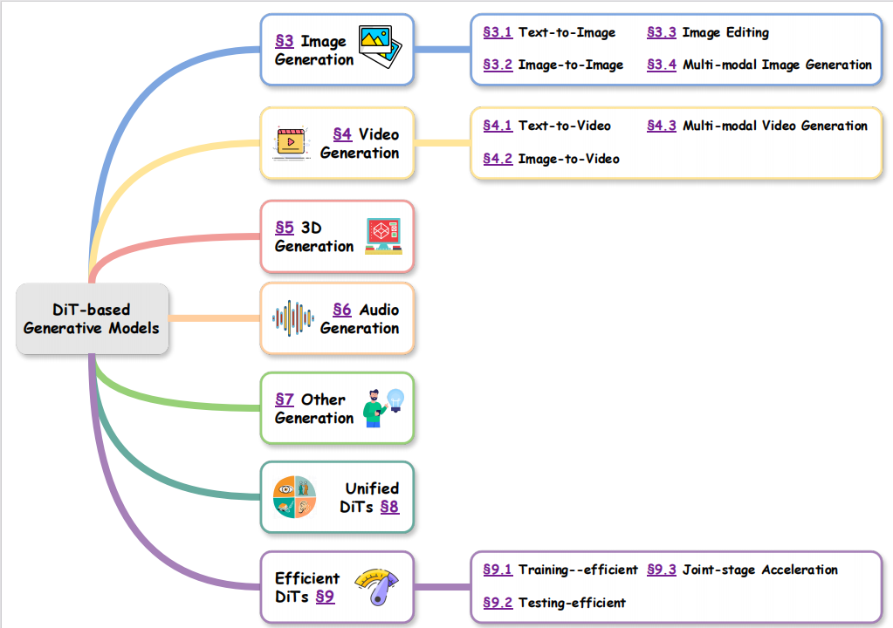

#  🔍 A Survey on Diffusion Transformers: Models, Applications, and Advances

     <strong>Lu Zhang</strong> · <strong>Runhao Yang</strong> · <strong>Yunzhi Zhuge</strong> · <strong>Ping Hu</strong> · <strong>Xu Jia</strong> · <strong>Pingping Zhang</strong> · <strong>Dong Wang</strong> · <strong>Huchuan Lu</strong> · <strong>You He</strong>
    

  

    
  

⭐ Welcome to the official repository of our survey paper. 

💗Please feel free to [open issues](https://github.com/IIAU-ZhangLu/DiT-AllInGen/issues) for any possibly missed wonderful work related to Diffusion Transformers (DiT).

## ✨ Introduction
Our survey provides a comprehensive overview of recent advances in DiT, with a focus on their application across diverse generative tasks.We categorize existing methods by domain, including image generation, video synthesis, 3D content creation, audio generation, and other specialized tasks. 

## 📜 Table of Contents Diagram

  

## 📷 DiT for Image Generation

In this chapter, we categorize DiT-based image generation methods into four representative task types based on the nature of their input conditions and transformation goals.

|Task Setting  | Year | Venue | Paper Abbr | Paper Title | Highlight | Project/Code |
|--------------|------|-------|------------|-------------|-----------|--------------|
|**Text-to-Image**|2023  |ICCV      |MDTv2       |[Mdtv2: Masked diffusion transformer is a strong image synthesize](https://arxiv.org/abs/2303.14389)|A mask latent modeling scheme to enhance context relation learning|[Code](https://github.com/sail-sg/MDT)|
|     |2023  |ArXiv   |DiffFit       |[DiffFit: Unlocking Transferability of Large Diffusion Models via Simple Parameter-Efficient Fine-Tuning](https://arxiv.org/abs/2304.06648)|Parameter-efficient finetuning via low-rank adaptation of DiT layers|[Code](https://github.com/mkshing/DiffFit-pytorch)|
|     |2024  |ICML   |HDiT    |[Scalable High-Resolution Pixel-Space Image Synthesis with Hourglass Diffusion Transformers](https://arxiv.org/abs/2401.11605)|Hourglass architecture enabling multi-scale context aggregation in DiT|[Project](https://github.com/crowsonkb/k-diffusion)|
|     |2025  | ArXiv  |D²iT      |[D²iT: Dynamic Diffusion Transformer for Accurate Image Generation](https://arxiv.org/abs/2504.09454)|Dynamic VAE and DiT to embed multi-grained latent codes and noises|❌|
|     |2024  | ICML   |SD3     |[Scaling rectified flow transformers for high-resolution image synthesis](https://arxiv.org/abs/2403.03206)|DiT framework for high-fidelity, prompt-aligned image generation|❌|
|     |2024  |    |FLUX     |-|Unified foundation model for scalable and compositional T2I generation|[Code](https://github.com/black-forest-labs/flux)|
|     |2024  | ICLR |DART   |[DART: Denoising Autoregressive Transformer for Scalable Text-to-Image Generation](https://arxiv.org/abs/2410.08159)|Integrating retrogressive decoding into DiT for improved visual consistency|❌|
|     |2024  | ACCV |PSG-Adapter   |[PSG-Adapter: Controllable Planning Scene Graph for Improving Text-to-Image Diffusion](https://openaccess.thecvf.com/content/ACCV2024/papers/Gao_PSG-Adapter_Controllable_Planning_Scene_Graph_for_Improving_Text-to-Image_Diffusion_ACCV_2024_paper.pdf)|Scene graph-conditioned DiT with plug-and-play cross-attention adapters|❌|
|     |2024  | CVPR |TexTok   |[Language-Guided Image Tokenization for Generation](https://arxiv.org/abs/2412.05796)|Text-conditioned tokenization to enhance semantic representation in generation|[Project](https://kaiwenzha.github.io/textok/)|
|     |2024  | NeurIPS |LI-DiT   |[Exploring the Role of Large Language Models in Prompt Encoding for Diffusion Models](https://arxiv.org/abs/2406.11831)|LLM-integrated DiT for language-aware and compositional image synthesis|❌|
|     |2024  | NeurIPS |EvolveDirector   |[EvolveDirector: Approaching Advanced Text-to-Image Generation with Large Vision-Language Models](https://arxiv.org/abs/2410.07133)|Vision-language model-guided DiT with evolutionary prompt planning|[Code](https://github.com/showlab/EvolveDirector)|
|     |2025  | ArXiv |Zuo et al. |[Zero-Shot Subject-Centric Generation for Creative Application Using Entropy Fusion](https://arxiv.org/abs/2503.10697)|Entropy-based fusion for zero-shot subject-centric image generation|❌|
|     |2025  |ICASSP  |DiTPipe   |[Enhancing Image Generation Fidelity via Progressive Prompts](https://arxiv.org/abs/2501.07070)|Region-aware prompt-following generation without extra finetuning|[Code](https://github.com/ZhenXiong-dl/ICASSP2025-RCAC)
|     |2025  |ArXiv  |LDGen   |[LDGen: Enhancing Text-to-Image Synthesis via Large Language Model-Driven Language Representation](https://arxiv.org/abs/2502.18302)|Multilingual T2I enabled by LLM-driven hierarchical text representations|[Project](https://zrealli.github.io/LDGen/)
|**Image-to-Image**|2024  |CVPR  |FoundHand   |[FoundHand: Large-Scale Domain-Specific Learning for Controllable Hand Image Generation](https://arxiv.org/abs/2412.02690)|Domain-specific hand image generation via prompt and geometry control|[Project](https://github.com/arthurchen0518/FoundHand)
|     |2024  |ICML  |MDPT   |[Cross-view Masked Diffusion Transformers for Person Image Synthesis](https://arxiv.org/abs/2402.01516)|Cross-view masked diffusion for pose-guided person image synthesis|[Code](https://github.com/trungpx/xmdpt)
|     |2025  |ArXiv  |U-StyDiT   |[U-StyDiT: Ultra-high Quality Artistic Style Transfer Using Diffusion Transformers](https://arxiv.org/abs/2503.08157)|High-fidelity artistic style transfer with transformer-enhanced latent diffusion|❌|
| **Image-Editing**|2024  |ArXiv |LazyDiffusion|[Lazy Diffusion Transformer for Interactive Image Editing](https://arxiv.org/abs/2404.12382)|Fast interactive editing via mask-aware DiT with context encoder|[Project](https://lazydiffusion.github.io/)|
|     |2024  |CVPR |LayerDecomp |[Generative Image Layer Decomposition with Visual Effects](https://arxiv.org/abs/2411.17864)|Layer-wise RGB-alpha decomposition guided by masks in DiT framework|[Project](https://rayjryang.github.io/LayerDecomp/)|
|     |2024  |ArXiv|FluxSpace |[FluxSpace: Disentangled Semantic Editing in Rectified Flow Transformers](https://arxiv.org/abs/2412.09611)|Semantic disentanglement for localized and subject-consistent editing|[Project](https://fluxspace.github.io/)|
|     |2025  |CVPR|ObjectMover |[ObjectMover: Generative Object Movement with Video Prior](https://arxiv.org/abs/2503.08037)|Unified object manipulation using video-trained DiT with multiple instructions|[Project](https://xinyu-andy.github.io/ObjMover/)|
|     |2024  |ArXiv|DiT4Edit |[DiT4Edit: Diffusion Transformer for Image Editing](https://arxiv.org/abs/2411.03286)|Patch-wise attention control across generation and reconstruction branches|❌|
|     |2025  |ICCV|KV-Edit |[KV-Edit: Training-Free Image Editing for Precise Background Preservation](https://arxiv.org/abs/2502.17363)|Key-Value caching for consistent background preservation during editing|[Project](https://xilluill.github.io/projectpages/KV-Edit/)|
|     |2025  |ArXiv|DCEdit |[DCEdit: Dual-Level Controlled Image Editing via Precisely Localized Semantics](https://arxiv.org/abs/2503.16795)|Semantic localization for dual-level editing at feature and latent scales|❌|
| **Multi-modal Control**|2024  |ArXiv|EMMA |[EMMA: Your Text-to-Image Diffusion Model Can Secretly Accept Multi-Modal Prompts](https://arxiv.org/abs/2406.09162)|Text-image-fusion DiT for human-centric multi-modal generation|[Project](https://tencentqqgylab.github.io/EMMA/)|
|     |2024  |ICCV|InfU|[InfiniteYou: Flexible Photo Recrafting While Preserving Your Identity](https://arxiv.org/abs/2503.16418)|Identity-preserving generation via diffusion-based subject guidance|[Project](https://bytedance.github.io/InfiniteYou/)|
|     |2025  |ArXiv|XVerse |[XVerse: Consistent Multi-Subject Control of Identity and Semantic Attributes via DiT Modulation](https://arxiv.org/abs/2506.21416)|Multi-subject, attribute-controllable generation via token-wise DiT modulation|[Project](https://bytedance.github.io/XVerse/)|
|     |2025  |ICCV|UniCombine |[UniCombine: Unified Multi-Conditional Combination with Diffusion Transformer](https://arxiv.org/abs/2503.09277)|Unified DiT with LoRA-based attention for multi-condition compositional synthesis|[Code](https://github.com/Xuan-World/UniCombine)|

## 📽️ DiT for Video Generation

In this sections, we categorize DiT-based video generation methods into several subgroups based on their input conditions and generative goals, including Text-to-video generation, Image-to-video generation, and Multi-modal controllable video generation.

|Task Setting  | Year | Venue | Paper Abbr | Paper Title | Highlight | Project/Code |
|--------------|------|-------|------------|-------------|-----------|--------------|
|**Text-to-Video**|2024  |TMLR|Latte |[Latte: Latent Diffusion Transformer for Video Generation](https://arxiv.org/abs/2401.03048)|A latent diffusion transformer for video generation|[Project](https://maxin-cn.github.io/latte_project/)|
|     |2024  |ICLR|CogVideoX |[CogVideoX: Text-to-Video Diffusion Models with An Expert Transformer](https://arxiv.org/abs/2408.06072)|Motion-aware DiT with 3D VAE for scalable T2V generation|[Code](https://github.com/zai-org/CogVideo)|
|     |2024  |NeurIPS|FIFO-Diffusion |[FIFO-Diffusion: Generating Infinite Videos from Text without Training](https://arxiv.org/abs/2405.11473)|A training-free framework for long video generation from text|[Project](https://jjihwan.github.io/projects/FIFO-Diffusion)|
|     |2024  |CVPR|GenTron |[GenTron: Diffusion Transformers for Image and Video Generation](https://arxiv.org/abs/2312.04557)|Motion-free guidance integrated into DiT for controllable T2V generation|[Project](https://www.shoufachen.com/gentron_website/)|
|     |2024  |CVPR|DiTCtrl |[DiTCtrl: Exploring Attention Control in Multi-Modal Diffusion Transformer for Tuning-Free Multi-Prompt Longer Video Generation](https://arxiv.org/abs/2412.18597)|A training-free MM-Dit-based framework for multi-prompt video generation|[Project](https://onevfall.github.io/project_page/ditctrl/)|
|     |2025  |ArXiv|On-device Sora |[On-device Sora: Enabling Training-Free Diffusion-based Text-to-Video Generation for Mobile Devices](https://arxiv.org/abs/2502.04363)|Lightweight DiT adaption for mobile-wise video generation|[Code](https://github.com/eai-lab/On-device-Sora)|
|     |2025  |ArXiv|CascadeV |[CascadeV: An Implementation of Wurstchen Architecture for Video Generation](https://arxiv.org/abs/2501.16612)|A cascaded latent DiT for coarse-to-fine T2V generation|[Code](https://github.com/bytedance/CascadeV)|
|     |2025  |ArXiv|RepVideo |[RepVideo: Rethinking Cross-Layer Representation for Video Generation](https://arxiv.org/abs/2501.08994)|Aggregate and stabilize intermediate representations for T2V generation|[Project](https://vchitect.github.io/RepVid-Webpage/)|
|     |2025  |CVPR|BlobGEN-Vid |[BlobGEN-Vid: Compositional Text-to-Video Generation with Blob Video Representations](https://arxiv.org/abs/2501.07647)|Implicit blob representations for fine-grained motion or appearance control|[Project](https://blobgen-vid.github.io/)|
|     |2025  |ArXiv|APT |[Diffusion Adversarial Post-Training for One-Step Video Generation](https://arxiv.org/abs/2501.08316)|Unified DiT for single-step image and video generation|[Project](https://seaweed-apt.com/)|
|     |2025  |CVPR|HumanDreamer |[HumanDreamer: Generating Controllable Human-Motion Videos via Decoupled Generation](https://arxiv.org/abs/2503.24026)|DiT-based human-centric T2V with pose-aware modeling|[Project](https://humandreamer.github.io/)|
|     |2025  |CVPR|Mask²DiT |[Mask²DiT: Dual Mask-based Diffusion Transformer for Multi-Scene Long Video Generation](https://arxiv.org/abs/2503.19881)|Dual masked-DiT for multi-scene long video generation|[Project](https://tianhao-qi.github.io/Mask2DiTProject/)|
|     |2025  |ArXiv|Vchitect-2.0 |[Vchitect-2.0: Parallel Transformer for Scaling Up Video Diffusion Models](https://arxiv.org/abs/2501.08453)|Parallel transformer architecture for efficient T2V generation|[Code](https://github.com/Vchitect/Vchitect-2.0)|
|**Image-to-Video**|2024  |ICLR|TA |[Trajectory Attention for Fine-grained Video Motion Control](https://arxiv.org/abs/2411.19324)|Trajectory‑aware attention in DiT for precise camera motion control|[Project](https://xizaoqu.github.io/trajattn/)|
|     |2024  |CVPR|KFC-W |[Generating 3D-Consistent Videos from Unposed Internet Photos](https://arxiv.org/abs/2411.13549)|Generating 3D-consistent videos from unposed internet photos|[Project](https://genechou.com/kfcw/)|
|     |2024  |SIGGRAPH|Human4DiT |[Human4DiT: 360-degree Human Video Generation with 4D Diffusion Transformer](https://arxiv.org/abs/2405.17405)|360-Degree human video generation with 4D DiT|[Project](https://human4dit.github.io/)|
|     |2024  |CVPR|AnimateAnything |[AnimateAnything: Consistent and Controllable Animation for Video Generation](https://arxiv.org/abs/2411.10836)|Animate any subject with camera signal and optical flow as guidance|[Code](https://github.com/yu-shaonian/AnimateAnything)|
|     |2025  |SIGGRAPH|DaS |[Diffusion as Shader: 3D-aware Video Diffusion for Versatile Video Generation Control](https://arxiv.org/abs/2501.03847)|Versatile video generation with 3D-aware motion guidance|[Project](https://igl-hkust.github.io/das/)|
|     |2025  |ICCV|MagicMotion |[MagicMotion: Controllable Video Generation with Dense-to-Sparse Trajectory Guidance](https://arxiv.org/abs/2503.16421)|Multi-granularity controlled I2V generation|[Project](https://quanhaol.github.io/magicmotion-site/)|
|     |2025  |ArXiv|UniAnimate-DiT |[UniAnimate-DiT: Human Image Animation with Large-Scale Video Diffusion Transformer](https://arxiv.org/abs/2504.11289)|Human image nomination with image and pose guidance|[Code](https://github.com/ali-vilab/UniAnimate-DiT)|
|     |2025  |ICCV|ReCamMaster |[ReCamMaster: Camera-Controlled Generative Rendering from A Single Video](https://arxiv.org/abs/2503.11647)|Re-shooting a source video with novel camera trajectories|[Project](https://jianhongbai.github.io/ReCamMaster/)|
|     |2025  |ArXiv|CameraCtrl II |[CameraCtrl II: Dynamic Scene Exploration via Camera-controlled Video Diffusion Models](https://arxiv.org/abs/2503.10592)|Camera controllable DiT for I2V generation|[Project](https://hehao13.github.io/Projects-CameraCtrl-II/)|
|**Multi-modal Control**|2024  |ArXiv|Sora |[Sora: A Review on Background, Technology, Limitations, and Opportunities of Large Vision Models](https://arxiv.org/abs/2402.17177)|Foundation video synthesis models supporting multimodal input|❌|
|     |2024  |ArXiv|Open-Sora |[Open-Sora: Democratizing Efficient Video Production for All](https://arxiv.org/abs/2412.20404)|Open-source implementation of spatial-temporal DiT for video|[Code](https://github.com/hpcaitech/Open-Sora)|
|     |2024  |ArXiv|InTraGen |[InTraGen: Trajectory-controlled Video Generation for Object Interactions](https://arxiv.org/abs/2411.16804)|Trajectory-controlled T2V with explicit path control|[Code](https://github.com/insait-institute/InTraGen)|
|     |2024  |ICLR|3DTrajMaster |[3DTrajMaster: Mastering 3D Trajectory for Multi-Entity Motion in Video Generation](https://arxiv.org/abs/2412.07759)|Identity-specific motion control with text and 3D trajectory|[Project](https://fuxiao0719.github.io/projects/3dtrajmaster/)|
|     |2024  |ArXiv|MotionStone |[MotionStone: Decoupled Motion Intensity Modulation with Diffusion Transformer for Image-to-Video Generation](https://arxiv.org/abs/2412.05848)|Decouples motion intensity in DiT for text+image video control|❌|
|     |2024  |CVPR|StyleMaster |[StyleMaster: Stylize Your Video with Artistic Generation and Translation](https://arxiv.org/abs/2412.07744)|A unified DiT for video style transfer and stylized video generation|[Project](https://zixuan-ye.github.io/stylemaster/)|
|     |2024  |ArXiv|STIV |[STIV: Scalable Text and Image Conditioned Video Generation](https://arxiv.org/abs/2412.07730)|DiT for joint text-and-image video generation|❌|
|     |2024  |CVPR|Hallo3|[Hallo3: Highly Dynamic and Realistic Portrait Image Animation with Video Diffusion Transformer](https://arxiv.org/abs/2412.00733)|Human animation with text, image, and audio as guidance|[Project](https://fudan-generative-vision.github.io/hallo3/#/)|
|     |2024  |CVPR|Tora |[Tora: Trajectory-oriented Diffusion Transformer for Video Generation](https://arxiv.org/abs/2407.21705)|Multi‑modal DiT with text, image & audio for talking character animation|[Code](https://github.com/alibaba/Tora)|
|     |2024  |ArXiv|DiVE |[DiVE: DiT-based Video Generation with Enhanced Control](https://arxiv.org/abs/2409.01595)|BEV-conditional DiT for driving‑scenario video synthesis|[Project](https://liautoad.github.io/DIVE/)|
|     |2024  |ArXiv|LTX-Video |[LTX-Video: Realtime Video Latent Diffusion](https://arxiv.org/abs/2501.00103)|Scalable video latent diffusion for T2V and I2V generation|[Code](https://github.com/Lightricks/LTX-Video)|
|     |2025  |ArXiv|FullDiT |[FullDiT: Multi-Task Video Generative Foundation Model with Full Attention](https://arxiv.org/abs/2503.19907)|Multi-task video generation with composited conditions|[Project](https://fulldit.github.io/)|
|     |2025  |ArXiv|LCT |[Long Context Tuning for Video Generation](https://arxiv.org/abs/2503.10589)|Long‑context DiT with sequential video conditioning for longer output|[Project](https://guoyww.github.io/projects/long-context-video/)|
|     |2025  |ArXiv|Phantom |[Phantom: Subject-consistent video generation via cross-modal alignment](https://arxiv.org/abs/2502.11079)|Subject-consistent video generation with multi-modal alignment|[Project](https://phantom-video.github.io/Phantom/)|
|     |2025  |ArXiv|ChatAnyone |[ChatAnyone: Stylized Real-time Portrait Video Generation with Hierarchical Motion Diffusion Model](https://arxiv.org/abs/2503.21144)|Talking head synthesis conditioned on image, audio, and expression control|[Project](https://humanaigc.github.io/chat-anyone/)|
|     |2025  |CVPR|AudCast |[AudCast: Audio-Driven Human Video Generation by Cascaded Diffusion Transformers](https://arxiv.org/abs/2503.19824)|Audio-guided DiT for subject-consistent human video generation|[Project](https://guanjz20.github.io/projects/AudCast/)|
|     |2025  |ArXiv|Cosh-DiT |[Cosh-DiT: Co-Speech Gesture Video Synthesis via Hybrid Audio-Visual Diffusion Transformers](https://arxiv.org/abs/2503.09942)|Co-speed motion and video synthesis with hybrid DiTs|[Project](https://sunyasheng.github.io/projects/COSH-DIT)|
|     |2025  |ArXiv|MoCha |[MoCha: Towards Movie-Grade Talking Character Synthesis](https://arxiv.org/abs/2503.23307)|Audio-text guided movie-grade talking character synthesis|[Project](https://congwei1230.github.io/MoCha/)|
|     |2025  |ArXiv|SeMo |[A Self-supervised Motion Representation for Portrait Video Generation](https://arxiv.org/abs/2503.10096)|Audio-image conditioned DiT human video generation|❌|
|     |2025  |ArXiv|CINEMA |[CINEMA: Coherent Multi-Subject Video Generation via MLLM-Based Guidance](https://arxiv.org/abs/2503.10391)|MLLM-guided DiT for multi-subject video generation|❌|
|     |2025  |ArXiv|Set-and-Sequence |[Dynamic Concepts Personalization from Single Videos](https://arxiv.org/abs/2502.14844)|Single‑video conditioned DiT for custom sequence generation|[Project](https://snap-research.github.io/dynamic_concepts/)|
|     |2025  |ArXiv|DreamRelation |[DreamRelation: Relation-Centric Video Customization](https://arxiv.org/abs/2503.07602)|Relation-centric DiT for video customization|[Project](https://dreamrelation.github.io/)|
|     |2025  |SIGGRAPH|CineMaster |[CineMaster: A 3D-Aware and Controllable Framework for Cinematic Text-to-Video Generation](https://arxiv.org/abs/2502.08639)|3D box + camera + text‑conditioned DiT for controllable scene video|[Project](https://cinemaster-dev.github.io/)|

## 🎲 DiT for 3D Generation

 In this section, we categorize existing DiT-based 3D methods into four subgroups: 3D shape generation,which focuses on single-object modeling from scratch; 3D representation learning, which aims to build effective latent spaces or cross-modal embeddings for 3D data; 3D Controlled Generation, which leverages explicit inputs like text, pose, or geometry for conditional generation; and Large-vocabulary 3D Generation, which targets diverse,multi-instance, or scene-level 3D synthesis across categories.

### 3D Shape Generation

| Year | Venue | Paper Abbr | Paper Title | Highlight | Project/Code |
|------|-------|------------|-------------|-----------|--------------|
|2023  |NeurIPS|DiT-3D |[DiT-3D: Exploring Plain Diffusion Transformers for 3D Shape Generation](https://arxiv.org/abs/2307.01831)|Adapts 2D DiTs for 3D point clouds with positional embeddings|[Project](https://dit-3d.github.io/)|
|2024  |ArXiv|DiM-3D |[Efficient 3D Shape Generation via Diffusion Mamba with Bidirectional SSMs](https://arxiv.org/abs/2406.05038)|Improves memory and efficiency for high-resolution 3D shape generation|❌|
|2024  |ECCV|FastDiT-3D |[Fast Training of Diffusion Transformer with Extreme Masking for 3D Point Clouds Generation](https://arxiv.org/abs/2312.07231)|Accelerates 3D diffusion with voxel-aware masking and minimal quality loss|[Project](https://dit-3d.github.io/FastDiT-3D/)|
|2024  |ECCV|DiffSurf |[DiffSurf: A Transformer-based Diffusion Model for Generating and Reconstructing 3D Surfaces in Pose](https://arxiv.org/abs/2408.14860)|Cross-plane attention for diverse 3D category generation|[Code](https://github.com/yusukey03012/DiffSurf)|
|2024  |CVPR|BDM |[Bayesian Diffusion Models for 3D Shape Reconstruction](https://arxiv.org/abs/2403.06973)|Bayesian diffusion model for single-view 3D reconstruction with uncertainty|[Project](https://mlpc-ucsd.github.io/BDM/)|

### Representation Learning

| Year | Venue | Paper Abbr | Paper Title | Highlight | Project/Code |
|------|-------|------------|-------------|-----------|--------------|
|2024  |ILCR|LaGeM |[LaGeM: A Large Geometry Model for 3D Representation Learning and Diffusion](https://arxiv.org/abs/2410.01295)|Geometry-based model learns 3D latent codes for conditional generation|[Project](https://1zb.github.io/LaGeM/)|
|2024  |NeurIPS|Direct3D |[Direct3D: Scalable Image-to-3D Generation via 3D Latent Diffusion Transformer](https://arxiv.org/abs/2405.14832)|Semantic disentanglement for localized and subject-consistent editing|[Project](https://nju-3dv.github.io/projects/Direct3D/)|
|2024  |CVPR|3DTopia-XL |[3DTopia-XL: Scaling High-quality 3D Asset Generation via Primitive Diffusion](https://arxiv.org/abs/2409.12957)|2D-to-3D mapping via gradient-based optimization|[Project](https://3dtopia.github.io/3DTopia-XL/)|
|2024  |3DV|Omages |[An Object is Worth 64x64 Pixels: Generating 3D Object via Image Diffusion](https://arxiv.org/abs/2408.03178)|Controls 3D object generation via 64×64 2D image diffusion|[Project](https://omages.github.io/)|
|2024  |ECCV|GOEmbed |[GOEmbed: Gradient Origin Embeddings for Representation Agnostic 3D Feature Learning](https://arxiv.org/abs/2312.08744)|Primitive-based high-resolution 3D generation from text or image inputs|[Project](https://holodiffusion.github.io/goembed/)|
|2025  |CVPR|3DEnhancer |[3DEnhancer: Consistent Multi-View Diffusion for 3D Enhancement](https://arxiv.org/abs/2412.18565)|Multi-view latent diffusion for 3D consistency enhancement|[Project](https://yihangluo.com/projects/3DEnhancer/)|

### 3D Controlled Generation

| Year | Venue | Paper Abbr | Paper Title | Highlight | Project/Code |
|------|-------|------------|-------------|-----------|--------------|
|2024  |ECCV|LN3Diff |[LN3Diff: Scalable Latent Neural Fields Diffusion for Speedy 3D Generation](https://arxiv.org/abs/2403.12019)|3D-aware latent diffusion for image/text-conditioned generation|[Project](https://nirvanalan.github.io/projects/ln3diff/)|
|2024  |CVPR|DI-PCG |[DI-PCG: Diffusion-based Efficient Inverse Procedural Content Generation for High-quality 3D Asset Creation](https://arxiv.org/abs/2412.15200)|Predicts procedural 3D assets from image-based generator parameters|[Project](https://thuzhaowang.github.io/projects/DI-PCG/)|
|2024  |ArXiv|TriFlow |[Taming Feed-forward Reconstruction Models as Latent Encoders for 3D Generative Models](https://arxiv.org/abs/2501.00651)|Text-image conditioned 3D shape generation via multi-stream transformer|[Project](https://triflow.github.io/)|
|2024  |ArXiv|SHADE |[Human-Aware 3D Scene Generation with Spatially-constrained Diffusion Models](https://arxiv.org/abs/2406.18159)|Human motions+Floor Plans& Human-aware 3D scene generation with motion and spatial constraints|[Project](https://hong-xl.github.io/SHADE/)|
|2025  |ICLR|GaussianAnything |[GaussianAnything: Interactive Point Cloud Flow Matching For 3D Object Generation](https://arxiv.org/abs/2411.08033)|Multi-modal point cloud space for fine-grained 3D control|[Project](https://nirvanalan.github.io/projects/GA/)|
|2025  |CVPR|Turbo3D |[Turbo3D: Ultra-fast Text-to-3D Generation](https://arxiv.org/abs/2412.04470)|Ultra-fast 4-step text-to-3D generation with Gaussian reconstruction|[Project](https://turbo-3d.github.io/)|
|2025  |ArXiv|MeshCraft |[MeshCraft: Exploring Efficient and Controllable Mesh Generation with Flow-based DiTs](https://arxiv.org/abs/2503.23022)|Controllable mesh generation using flow-based diffusion transformer|❌|

### Large-vocabulary 3D Generation

| Year | Venue | Paper Abbr | Paper Title | Highlight | Project/Code |
|------|-------|------------|-------------|-----------|--------------|
|2023  |ILCR|DiffTF |[Large-Vocabulary 3D Diffusion Model with Transformer](https://arxiv.org/abs/2309.07920)|Cross-plane attention for diverse 3D category generation|[Project](https://ziangcao0312.github.io/difftf_pages/)|
|2024  |ArXiv|CityCraft |[CityCraft: A Real Crafter for 3D City Generation](https://arxiv.org/abs/2406.04983)|Text-driven city generation via DiT, LLMs, and asset retrieval|[Code](https://github.com/djFatNerd/CityCraft)|
|2025  |CVPR|MIDI |[MIDI: Multi-Instance Diffusion for Single Image to 3D Scene Generation](https://arxiv.org/abs/2412.03558)|Single-image multi-object 3D generation with interaction modeling|[Project](https://huanngzh.github.io/MIDI-Page/)|
|2025  |ArXiv|DiffTF++ |[DiffTF++: 3D-aware Diffusion Transformer for Large-Vocabulary 3D Generation](https://arxiv.org/abs/2405.08055)|Coarse-to-fine DiT with enhanced structural 3D attention|❌|
|2024  |ArXiv|Hunyuan3D 2.0 |[Hunyuan3D 2.0: Scaling Diffusion Models for High Resolution Textured 3D Assets Generation](https://arxiv.org/abs/2501.12202v3)|Large-scale 3D shape and texture generation platform|[Code](https://github.com/Tencent-Hunyuan/Hunyuan3D-2)|

## 🔊 DiT for Audio Generation

In this chapter, we categorize DiT-based Audio generation methods into four representative task types based on the nature of their input conditions and transformation goals.

|Task Setting  | Year | Venue | Paper Abbr | Paper Title | Highlight | Project/Code |
|--------------|------|-------|------------|-------------|-----------|--------------|
|**Cross-modal generation**|2024  |InterSpeech|EzAudio |[EzAudio: Enhancing Text-to-Audio Generation with Efficient Diffusion Transformer](https://arxiv.org/abs/2409.10819)|A text-to-audio(T2A) generation framework based DiTs|❌|
|     |2024  |ArXiv|SILA |[SILA: Signal-to-Language Augmentation for Enhanced Control in Text-to-Audio Generation](https://arxiv.org/abs/2412.09789)|Signal-to-language for text-to-audio generation|[Project](https://sonalkum.github.io/SILA/)|
|     |2024  |ICLR|SpatialSonic |[Both Ears Wide Open: Towards Language-Driven Spatial Audio Generation](https://arxiv.org/abs/2410.10676)|A model for controllable spatial audio generation|[Project](https://peiwensun2000.github.io/bewo/)|
|     |2025  |AAAI|Tri-Ergon |[Tri-Ergon: Fine-grained Video-to-Audio Generation with Multi-modal Conditions and LUFS Control](https://arxiv.org/abs/2412.20378)|A framework for video-to-audio(V2A) generation|[Project](https://tri-ergon.github.io/Tri-Ergon/)|
|     |2025  |ICASSP|SAP |[Stable Audio Open](https://arxiv.org/abs/2407.14358)|A open weights text-to-audio model trained with Creative Commons data|[Code](https://github.com/Stability-AI/stable-audio-tools)|
|     |2025  |ICASSP|AudioComposer |[AudioComposer: Towards Fine-grained Audio Generation with Natural Language Descriptions](https://arxiv.org/abs/2409.12560)|Only using natural language descriptions to control audio generation|[Project](https://lavendery.github.io/AudioComposer/)|
|     |2025  |ArXiv|CAFA |[CAFA: a Controllable Automatic Foley Artist](https://arxiv.org/abs/2504.06778)|A controllable automatic foley artist for video-and-text-to-audio task|[Project](https://cafa-vt2a.github.io/CAFA/)|
|     |2025  |ICASSP|MSN |[Make Some Noise: Towards LLM audio reasoning and generation using sound tokens](https://arxiv.org/abs/2503.22275)|Audio inference and generation based on pre-trained LLMS|❌|
|     |2025  |CVPR|MultiFoley |[Video-Guided Foley Sound Generation with Multimodal Controls](https://arxiv.org/abs/2411.17698)|A model for video-guided sound generation supporting multimodal condition|[Project](https://ificl.github.io/MultiFoley/)|
|     |2025  |ICASSP|VoiceDiT |[VoiceDiT: Dual-Condition Diffusion Transformer for Environment-Aware Speech Synthesis](https://arxiv.org/abs/2412.19259)|Producing environment-aware speech and audio from text and visual prompts|[Project](https://mm.kaist.ac.kr/projects/voicedit/)|
|**Audio Enhancement**|2024  |InterSpeech|CIGDTN |[Complex Image-Generative Diffusion Transformer for Audio Denoising](https://arxiv.org/abs/2406.09161)|A image-generative diffusion transformer network model for audio denoising|❌|
|**Voice Conversion**|2025  |AAAI|StableVC |[StableVC: Style Controllable Zero-Shot Voice Conversion with Conditional Flow Matching](https://arxiv.org/abs/2412.04724)|A style-controllable zero-shot voice conversion model|[Project](https://yaoxunji.github.io/stablevc/)|
|     |2025  |ICASSP|VoicePrompter |[VoicePrompter: Robust Zero-Shot Voice Conversion with Voice Prompt and Conditional Flow Matching](https://arxiv.org/abs/2501.17612)|A zero-shot voice conversion model based DiT|[Project](https://hayeong0.github.io/VoicePrompter-demo/)|
|**Text-to-Speech**|2023  |EMNLP|ViT-TTS |[ViT-TTS: Visual Text-to-Speech with Scalable Diffusion Transformer](https://arxiv.org/abs/2305.12708)|The first visual text-to-speech model with vision-text fusion|[Project](https://vit-tts.github.io/)|
|     |2023  |ArXiv|U-DiT |[U-DiT TTS: U-Diffusion Vision Transformer for Text-to-Speech](https://arxiv.org/abs/2305.13195)|A mel spectrogram-based acoustic model|[Project](https://eihw.github.io/u-dit-tts/)|
|     |2023  |ArXiv|Adaptive TTS |[Diffusion Transformer for Adaptive Text-to-Speech](https://openreview.net/pdf?id=hRHX6XW9_Gu)|Diffusion transformer for TTS integrated with adaptive layer norm|[Project](https://recherchetts.github.io/dit/)|
|     |2024  |ArXiv|F5-TTS |[F5-TTS: A Fairytaler that Fakes Fluent and Faithful Speech with Flow Matching](https://arxiv.org/abs/2410.06885)|A fully non-autoregressive text-to-speech model based on flow matching with DiT|[Project](https://swivid.github.io/F5-TTS/)|
|     |2024  |ICLR|DiTTo-TTS |[DiTTo-TTS: Diffusion Transformers for Scalable Text-to-Speech without Domain-Specific Factors](https://arxiv.org/abs/2406.11427)|A latent diffusion model(LDM) based-DiT for text-to-speech|[Project](https://ditto-tts.github.io/)|
|     |2024  |InterSpeech|SimpleSpeech |[SimpleSpeech: Towards Simple and Efficient Text-to-Speech with Scalar Latent Transformer Diffusion Models](https://arxiv.org/abs/2406.02328)|A non-autoregressive text-to-speech model integrated with LLMs|[Project](https://simplespeech.github.io/simplespeechDemo/)|
|     |2024  |ArXiv|ARDiT |[Autoregressive Diffusion Transformer for Text-to-Speech Synthesis](https://arxiv.org/abs/2406.05551)|A decoder-only autoregressive difussion transformer for TTS|[Project](https://zjlww.github.io/ardit-web/)|
|     |2024  |InterSpeech|DualSpeech |[DualSpeech: Enhancing Speaker-Fidelity and Text-Intelligibility Through Dual Classifier-Free Guidance](https://arxiv.org/abs/2408.14423)|A text-to-speech model combined a phoneme-level latent diffusion model with dual CFG|[Project](https://bit.ly/48Ewoib.)|
|     |2025  |ICML|DiTAR |[DiTAR: Diffusion Transformer Autoregressive Modeling for Speech Generation](https://arxiv.org/abs/2502.03930)|A patch-based autoregressive model integrated with LM and DiT for TTS|[Project](https://spicyresearch.github.io/ditar/)|

##  🎈 Unified DiTs

In this chapter, we categorize DiT-based unified models, which can simultaneously accept multimodal inputs and support generating multiple types of outputs within a single model.

|Task Setting  | Year | Venue | Paper Abbr | Paper Title | Highlight | Project/Code |
|--------------|------|-------|------------|-------------|-----------|--------------|
|**Image Generation**|2024  |ICLR|PixWizard |[PixWizard: Versatile Image-to-Image Visual Assistant with Open-Language Instructions](https://arxiv.org/abs/2409.15278)|Unified framework for diverse image tasks(generation,edit,inpainting)|[Code](https://github.com/AFeng-x/PixWizard)|
|     |2025  |ACM MM|MIGE |[MIGE: Mutually Enhanced Multimodal Instruction-Based Image Generation and Editing](https://arxiv.org/abs/2502.21291)|A unified framework combines subject-driven generation and instruction-based editing|[Code](https://github.com/Eureka-Maggie/MIGE)|
|     |2025  |CVPR|OmniGen |[OmniGen: Unified Image Generation](https://arxiv.org/abs/2409.11340v2)|A diffusion model for unified image generation|[Code](https://github.com/VectorSpaceLab/OmniGen)|
|     |2025  |CVPR|DreamOmni |[DreamOmni: Unified Image Generation and Editing](https://arxiv.org/abs/2412.17098)|A unified model for image generation and editing|[Project](https://zjbinxia.github.io/DreamOmni-ProjectPage/)|
|     |2025  |ICCV|RealGeneral |[RealGeneral: Unifying Visual Generation via Temporal In-Context Learning with Video Models](https://arxiv.org/abs/2503.10406)|A unified image generation framework via video models'temporal in-context learning|[Project](https://lyne1.github.io/realgeneral_web/)|
|     |2025  |ArXiv|UniVG |[UniVG: A Generalist Diffusion Model for Unified Image Generation and Editing](https://arxiv.org/abs/2504.02160)|Treat multi-modal inputs as unified conditions to enable diverse image generation|❌|
|     |2025  |ICCV|UNO |[Less-to-More Generalization: Unlocking More Controllability by In-Context Generation](https://arxiv.org/abs/2504.02160)|A unified customization framework for multi-subject image generation|[Project](https://bytedance.github.io/UNO/)|
|     |2025  |ICCV|Lumina-Image 2.0 |[Lumina-Image 2.0: A Unified and Efficient Image Generative Framework](https://arxiv.org/abs/2503.21758)|A unified text-to-image generation framework|[Code](https://github.com/Alpha-VLLM/Lumina-Image-2.0)|
|**Video Generation**|2025  |ICLR|VACE |[VACE: All-in-One Video Creation and Editing](https://arxiv.org/abs/2503.07598v2)|An all-in-one model for video creation and editing|[Project](https://ali-vilab.github.io/VACE-Page/)|
|**Cross-modal union**|2024  |ICLR|SyncFlow |[SyncFlow: Toward Temporally Aligned Joint Audio-Video Generation from Text](https://arxiv.org/abs/2412.15220)|Joint audio-video generation text-driven|[Project](https://syncflow-core.github.io/syncflow-demo/)|
|     |2024  |ICCV|AV-Link |[AV-Link: Temporally-Aligned Diffusion Features for Cross-Modal Audio-Video Generation](https://arxiv.org/abs/2412.15191)|A unified approach for V2A and A2V generation|[Project](https://snap-research.github.io/AVLink/)|
|     |2024  |ArXiv|AV-DiT |[AV-DiT: Efficient Audio-Visual Diffusion Transformer for Joint Audio and Video Generation](https://arxiv.org/abs/2406.07686)|The first multimodal DiT for joint audio and video generation|❌|
|**Multi modal/Multi task**|2023  |ArXiv|T1 |[T1: Scaling Diffusion Probabilistic Fields to High-Resolution on Unified Visual Modalities](https://arxiv.org/abs/2305.14674)|Generation images,videos,and 3D via DiT-based unified visual modality handling|[Project](https://t1-diffusion-model.github.io/)|
|     |2024  |ICLR|Show-o |[Show-o: One Single Transformer to Unify Multimodal Understanding and Generation](https://arxiv.org/abs/2408.12528v6)|A unified transformer to unify multimodal understanding and generation|[Code](https://github.com/showlab/Show-o)|
|     |2024  |ArXiv|ControlNeXt |[ControlNeXt: Powerful and Efficient Control for Image and Video Generation](https://arxiv.org/abs/2408.06070v3)|Controllable and unified image and video generation|[Project](https://pbihao.github.io/projects/controlnext/index.html)|
|     |2024  |ICLR & NeurIPS|Lumina-T2X |[Lumina-T2X: Transforming Text into Any Modality, Resolution, and Duration via Flow-based Large Diffusion Transformers](https://arxiv.org/abs/2405.05945)|Transform text instructions into any modality at arbitrary resolution and duration|[Code](https://github.com/Alpha-VLLM/Lumina-T2X)|
|     |2024  |NeurIPS|OmniTokenizer |[OmniTokenizer: A Joint Image-Video Tokenizer for Visual Generation](https://arxiv.org/abs/2406.09399)|A joint image-video tokenizer for visual generation|[Code](https://github.com/FoundationVision/OmniTokenizer)|
|     |2024  |ICLR|Qihoo-T2X |[Qihoo-T2X: An Efficient Proxy-Tokenized Diffusion Transformer for Text-to-Any-Task](https://arxiv.org/abs/2409.04005)|A unified model for T2I,T2V and T2MV|[Project](https://360cvgroup.github.io/Qihoo-T2X/)|
|     |2024  |ArXiv|ACDiT |[ACDiT: Interpolating Autoregressive Conditional Modeling and Diffusion Transformer](https://arxiv.org/abs/2412.07720)|A autoregressive blockwise conditional DiT for image and video generation|❌|
|     |2024  |ICCV|OminiControl |[OminiControl: Minimal and Universal Control for Diffusion Transformer](https://arxiv.org/abs/2411.15098)|A unified image-conditional control generation framework|[Code](https://github.com/Yuanshi9815/OminiControl)|
|     |2025  |ArXiv|OminiControl2 |[OminiControl2: Efficient Conditioning for Diffusion Transformers](https://arxiv.org/abs/2503.08280)|An efficient multi-condition control framework based on Ominicontrol|[Code](https://github.com/Yuanshi9815/OminiControl)|
|     |2025  |ArXiv|D-DiT |[Dual Diffusion for Unified Image Generation and Understanding](https://arxiv.org/pdf/2501.00289v2)|A unified multimodal image understanding and generation model|[Project](https://zijieli-jlee.github.io/dualdiff.github.io/)|
|     |2025  |CVPR|LaVin-DiT |[LaVin-DiT: Large Vision Diffusion Transformer](https://arxiv.org/abs/2411.11505)|A unified foundation model for computer vision|[Project](https://derrickwang005.github.io/LaVin-DiT/)|
|     |2025  |ArXiv|DICEPTION |[DICEPTION: A Generalist Diffusion Model for Visual Perceptual Tasks](https://arxiv.org/abs/2502.17157)|A generalist model capable of performing multiple visual perception tasks|[Project](https://aim-uofa.github.io/Diception/)|
|     |2025  |ArXiv|OmniLV |[Lumina-OmniLV: A Unified Multimodal Framework for General Low-Level Vision](https://arxiv.org/abs/2504.04903)|A universal multimodal multi-task framework for low-level vision|[Project](https://andrew0613.github.io/OmniLV_page/)|
|     |2025  |ArXiv|UniForm |[UniForm: A Unified Multi-Task Diffusion Transformer for Audio-Video Generation](https://arxiv.org/abs/2502.03897)|A unified multi-task audio-video generation model|[Project](https://uniform-t2av.github.io/)|

##  🚴‍♂️ Efficient DiTs

In this section, we provide a comprehensive overview of these developments by grouping efficient DiT-based methods into three major categories:training-efficient DiTs, inference-efficient DiTs, and joint training-inference optimization.

|Task Setting  | Year | Venue | Paper Abbr | Paper Title | Highlight | Project/Code |
|--------------|------|-------|------------|-------------|-----------|--------------|
|**Training-efficient**|2023  |ICLR|PixArt-α |[PixArt-α: Fast Training of Diffusion Transformer for Photorealistic Text-to-Image Synthesis](https://arxiv.org/abs/2310.00426v3)|Training decomposition with efficient DiT design and high-informative data|[Project](https://pixart-alpha.github.io/)|
|     |2024  |ArXiv|PixArt-Σ |[PixArt-Σ: Weak-to-Strong Training of Diffusion Transformer for 4K Text-to-Image Generation](https://arxiv.org/abs/2403.04692)|Weak-to-strong training with token compression for 4K image generation|[Project](https://pixart-alpha.github.io/PixArt-sigma-project/)|
|     |2024  |NeurIPS|FasterDiT |[FasterDiT: Towards Faster Diffusion Transformers Training without Architecture Modification](https://arxiv.org/abs/2410.10356v2)|SNR-PDF based supervision improves training speed and stability of DiTs|[Project](https://deep-diver.github.io/neurips2024/posters/cqrgodfagn/)|
|     |2024  |ICLR|PFM |[Pyramidal Flow Matching for Efficient Video Generative Modeling](https://arxiv.org/abs/2410.05954v2)|Spatial-temporal pyramids enable end-to-end efficient video DiT training|[Project](https://pyramid-flow.github.io/)|
|     |2025  |ArXiv|DSV |[DSV: Exploiting Dynamic Sparsity to Accelerate Large-Scale Video DiT Training](https://arxiv.org/abs/2502.07590v3)|Dynamic sparsity with key-value pruning boosts video DiT training throughput|❌|
|     |2025  |ArXiv|DiT-μP |[Scaling Diffusion Transformers Efficiently via μP](https://arxiv.org/abs/2505.15270)|Applies maximal update parametrization to accelerate scalable DiT training|[Code](https://github.com/ML-GSAI/Scaling-Diffusion-Transformers-muP)|
|**Test-efficient**|2023  |NeurIPS|GET |[One-Step Diffusion Distillation via Deep Equilibrium Models](https://arxiv.org/abs/2401.08639)|One-step distillation with deep equilibrium model for fast sampling|[Code](https://github.com/locuslab/get)|
|     |2024  |ICML|ASE |[A Simple Early Exiting Framework for Accelerated Sampling in Diffusion Models](https://arxiv.org/abs/2408.05927v1)|Adaptive early exiting to skip redundant denoising blocks during inference|[Code](https://github.com/taehong-moon/ee-diffusion)|
|     |2024  |CVPR|CausVid |[From Slow Bidirectional to Fast Autoregressive Video Diffusion Models](https://arxiv.org/abs/2412.07772v3)|Autoregressive generation with DMD distillation \& asymmetric teacher-student learning|[Project](https://causvid.github.io/)|
|     |2025  |ACM/SIGDA|FlightVGM |[FlightVGM: Efficient Video Generation Model Inference with Online Sparsification and Hybrid Precision on FPGAs](https://dai.sjtu.edu.cn/my_file/pdf/83b404ee-15a2-456f-a173-9d260ad2409f.pdf)|Distills bidirectional model into 4-step autoregressive generator via DMD framework|❌|
|     |2024  |ICML|AsymRnR |[AsymRnR: Video Diffusion Transformers Acceleration with Asymmetric Reduction and Restoration](https://arxiv.org/abs/2412.11706v3)|Improved head compression for high-dimensional multi-modal DiT attention|[Code](https://github.com/wenhao728/AsymRnR)|
|     |2024  |ICLR|PAB |[Real-Time Video Generation with Pyramid Attention Broadcast](https://arxiv.org/abs/2408.12588)|Asymmetric sequence reduction-restoration for efficient attention computation|[Code](https://github.com/NUS-HPC-AI-Lab/VideoSys)|
|     |2024  |NeurIPS|DiTFastAttn |[DiTFastAttn: Attention Compression for Diffusion Transformer Models](https://arxiv.org/abs/2406.08552v2)|Compresses spatial, temporal, and conditional heads for efficient attention|[Project](https://nics-effalg.com/DiTFastAttn)|
|     |2025  |ArXiv|DiTFastAttnV2 |[DiTFastAttnV2: Head-wise Attention Compression for Multi-Modality Diffusion Transformers](https://arxiv.org/abs/2503.22796)|Training-free sparse attention with profiling and inference optimization|[Code](https://github.com/thu-nics/DiTFastAttnV2)|
|     |2025  |ICML|SVG |[Sparse VideoGen: Accelerating Video Diffusion Transformers with Spatial-Temporal Sparsity](https://arxiv.org/abs/2502.01776v2)|Sliding tile attention with hardware-aware scheduling to lower FLOPs|[Code](https://github.com/svg-project/Sparse-VideoGen)|
|     |2025  |ICML|STA |[Fast Video Generation with Sliding Tile Attention](https://arxiv.org/abs/2502.04507v3)|Sliding tile attention to accelerate video generation in DiTs|[Project](https://github.com/hao-ai-lab/FastVideo)|
|     |2024  |NeurIPS |L2C |[Learning-to-Cache: Accelerating Diffusion Transformer via Layer Caching](https://arxiv.org/abs/2406.01733)|Learns routing to cache and reuse redundant layers dynamically|[Code](https://github.com/horseee/learning-to-cache)|
|     |2024  |ArXiv|Δ-DiT: |[Δ-DiT: A Training-Free Acceleration Method Tailored for Diffusion Transformers](https://arxiv.org/abs/2406.01125)|Caches and accelerates DiT blocks based on sampling stage|❌|
|     |2024  |ICCV|Skip-DiT |[Towards Stabilized and Efficient Diffusion Transformers through Long-Skip-Connections with Spectral Constraints](https://arxiv.org/abs/2411.17616v4)|Reuses features across time steps via skip-branch mechanism|[Code](https://github.com/OpenSparseLLMs/Skip-DiT)|
|     |2024  |ArXiv|PipeFusion |[PipeFusion: Patch-level Pipeline Parallelism for Diffusion Transformers Inference](https://arxiv.org/abs/2405.14430v3)|Patch-level pipeline parallelism with feature reuse for efficient DiT inference|[Code](https://github.com/xdit-project/xDiT)|
|     |2024  |ICLR|ToCa |[Accelerating Diffusion Transformers with Token-wise Feature Caching](https://arxiv.org/abs/2412.09611)|Token-wise feature caching for informative token prioritization|[Code](https://github.com/Shenyi-Z/ToCa)|
|     |2024  |ArXiv|xDiT |[xDiT: an Inference Engine for Diffusion Transformers (DiTs) with Massive Parallelism](https://arxiv.org/abs/2411.01738)|Hybrid parallel inference with sequence, patch-level, and CFG strategies|[Code](https://github.com/xdit-project/xDiT)|
|     |2025  |AAAI|LazyDiT |[LazyDiT: Lazy Learning for the Acceleration of Diffusion Transformers](https://arxiv.org/abs/2412.12444v3)|Skips redundant computation with intermediate result caching|[Code](https://github.com/shawnricecake/lazydit)|
|     |2025  |ICCV|QuantCache |[QuantCache: Adaptive Importance-Guided Quantization with Hierarchical Latent and Layer Caching for Video Generation](https://arxiv.org/abs/2503.06545)|Combines quantization and hierarchical caching for faster inference|[Code](https://github.com/JunyiWuCode/QuantCache)|
|     |2025  |ArXiv|UniCP |[UniCP: A Unified Caching and Pruning Framework for Efficient Video Generation](https://arxiv.org/abs/2502.04393)|Unified caching and pruning to enhance DiT video generation|❌|
|     |2024  |AAAI|VQ4DiT |[VQ4DiT: Efficient Post-Training Vector Quantization for Diffusion Transformers](https://arxiv.org/abs/2408.17131)|Vector quantization method to reduce DiT bit-width post-training|❌|
|     |2024  |NeurIPS|PTQ4DiT |[PTQ4DiT: Post-training Quantization for Diffusion Transformers](https://arxiv.org/abs/2405.16005v3)|Performs post-training quantization on DiTs without retraining overhead|[Code](https://github.com/adreamwu/PTQ4DiT)|
|     |2024  |ArXiv|HQ-DiT |[HQ-DiT: Efficient Diffusion Transformer with FP4 Hybrid Quantization](https://arxiv.org/abs/2405.19751v2)|Uses 4-bit floating-point quantization for weights and activations|❌|
|     |2024  |WACV|DiTAS |[DiTAS: Quantizing Diffusion Transformers via Enhanced Activation Smoothing](https://arxiv.org/abs/2409.07756v2)|Data-free post-training quantization using temporal smoothing and grid search|[Code](https://github.com/DZY122/DiTAS)|
|     |2025  |IEEE|MixDiT |[MixDiT: Accelerating Image Diffusion Transformer Inference with Mixed-Precision MX Quantization](https://arxiv.org/abs/2504.08398)|Applies mixed-scale microscaling to quantize DiT activations precisely|❌|
|     |2025  |ArXiv|QC |[Q&C: When Quantization Meets Cache in Efficient Image Generation](https://arxiv.org/abs/2503.02508)|Hierarchical quantization with caching to balance latency and precision|[Code](https://github.com/xinding-sys/Quant-Cache)|
|     |2025  |ArXiv|HTG |[Post-Training Quantization for Diffusion Transformer via Hierarchical Timestep Grouping](https://arxiv.org/abs/2503.06930)|Timestep grouping-based quantization to maintain temporal fidelity|❌|
|     |2025  |ArXiv|TQ-DiT |[TQ-DiT: Efficient Time-Aware Quantization for Diffusion Transformers](https://arxiv.org/abs/2502.04056)|Time-aware quantization strategy to improve DiT inference efficiency|❌|
|**Joint-stage Acceleration**|2024  |ICLR|CMD |[Efficient Video Diffusion Models via Content-Frame Motion-Latent Decomposition](https://arxiv.org/abs/2403.14148)|Factorizes content and motion latents for efficient training and sampling|[Project](https://sihyun.me/CMD/)|
|     |2024  |ArXiv|DiT-MoE |[Scaling Diffusion Transformers to 16 Billion Parameters](https://arxiv.org/abs/2407.11633v3)|Sparse expert routing reduces redundancy and cost across both stages|[Code](https://github.com/feizc/DiT-MoE)|
|     |2024  |NeurIPS|EDT |[EDT: An Efficient Diffusion Transformer Framework Inspired by Human-like Sketching](https://arxiv.org/abs/2410.23788)|Lightweight DiT with modulation and token-relation masking for efficiency|[Code](https://github.com/xinwangChen/EDT)|
|     |2024  |ICML|HarmoniCa |[HarmoniCa: Harmonizing Training and Inference for Better Feature Caching in Diffusion Transformer Acceleration](https://arxiv.org/abs/2410.01723v6)|Caching and denoising protocol enable accurate sampling with fewer steps|[Code](https://github.com/ModelTC/HarmoniCa)|
|     |2025  |CVPR|DiG |[DiG: Scalable and Efficient Diffusion Models with Gated Linear Attention](https://arxiv.org/abs/2405.18428v2)|Gated linear attention replaces quadratic form for complexity reduction|[Code](https://github.com/hustvl/DiG)|
|     |2025  |ArXiv|LiT |[LiT: Delving into a Simplified Linear Diffusion Transformer for Image Generation](https://arxiv.org/abs/2501.12976)|Linear blocks replace transformers to lower attention and inference cost|❌|
|     |2025  |AAAI|Flash Diffusion |[Flash Diffusion: Accelerating Any Conditional Diffusion Model for Few Steps Image Generation](https://arxiv.org/abs/2406.02347)|LoRA-based distillation preserves quality while reducing overall computation|[Code](https://github.com/gojasper/flash-diffusion)|

##  🎊 Other Application Tasks

### Design aesthetics

| Year | Venue | Paper Abbr | Paper Title | Highlight | Project/Code |
|------|-------|------------|-------------|-----------|--------------|
|2024  |CVPR|M&M VTO |[M&M VTO: Multi-Garment Virtual Try-On and Editing](https://arxiv.org/abs/2406.04542)|A model for multi-garment virtual try-on and editing|[Project](https://mmvto.github.io/)|
|2024  |SIGGRAPH|Fashion-VDM |[Fashion-VDM: Video Diffusion Model for Virtual Try-On](https://arxiv.org/abs/2411.00225v2)|Video virtual try-on based DiT|[Project](https://johannakarras.github.io/Fashion-VDM/)|
|2024  |ArXiv|VITON-DiT |[VITON-DiT: Learning In-the-Wild Video Try-On from Human Dance Videos via Diffusion Transformers](https://arxiv.org/abs/2405.18326)|The first DiT-based video try-on network|[Project](https://zhengjun-ai.github.io/viton-dit-page/)|
|2024  |ArXiv|FitDiT |[FitDiT: Advancing the Authentic Garment Details for High-fidelity Virtual Try-on](https://arxiv.org/abs/2503.06545)|Virtual try-on based on customized diffusion transformer|[Project](https://byjiang.com/FitDiT/)|
|2024  |ICCV|SewingLDM |[Multimodal Latent Diffusion Model for Complex Sewing Pattern Generation](https://arxiv.org/abs/2412.14453v2)|Generate complex sewing patterns via text, garment sketches and body shapes|[Project](https://shengqiliu1.github.io/SewingLDM/)|
|2025  |ArXiv|ITVTON |[ITVTON: Virtual Try-On Diffusion Transformer Based on Integrated Image and Text](https://arxiv.org/abs/2501.16757v2)|A virtual try-on diffusion transformer model|❌|
|2025  |CVPR|CatV²TON |[CatV²TON: Taming Diffusion Transformers for Vision-Based Virtual Try-On with Temporal Concatenation](https://arxiv.org/abs/2501.11325)|A diffusion transformer framework for both image and video virtual try-on tasks|[Code](https://github.com/Zheng-Chong/CatV2TON)|
|2025  |ArXiv|MC-VTON |[MC-VTON: Minimal Control Virtual Try-On Diffusion Transformer](https://arxiv.org/abs/2501.03630)|Integrate minimal condition inputs by leveraging DiT backbone|❌|
|2025  |CVPR|ITA-MDT |[ITA-MDT: Image-Timestep-Adaptive Masked Diffusion Transformer Framework for Image-Based Virtual Try-On](https://arxiv.org/abs/2503.20418v2)|A framework for the image-based virtual try-on (IVTON) task buildt upon MDT-IVTON|[Project](https://jiwoohong93.github.io/ita-mdt/)|

### Music Generation

| Year | Venue | Paper Abbr | Paper Title | Highlight | Project/Code |
|------|-------|------------|-------------|-----------|--------------|
|2024  |ArXiv|LFM |[Long-form music generation with latent diffusion](https://arxiv.org/abs/2404.10301)|A text-conditioned music generation model|❌|
|2024  |ICML|SCG |[Symbolic Music Generation with Non-Differentiable Rule Guided Diffusio](https://arxiv.org/abs/2402.14285v4)|Symbolic music generation with high time resolution|[Project](https://scg-rule-guided-music.github.io/)|
|2024  |ArXiv|MuDiT/MuSiT |[MuDiT & MuSiT: Alignment with Colloquial Expression in Description-to-Song Generation](https://arxiv.org/abs/2407.03188)|A model for colloquial description-to-song generation|❌|
|2024  |ArXiv|MuCodec |[MuCodec: Ultra Low-Bitrate Music Codec](https://arxiv.org/abs/2409.13216v3)|Ultra low-bitrate music compression and reconstruction|[Project](https://xuyaoxun.github.io/MuCodec_demo/)|
|2024  |ArXiv|MuVi |[MuVi: Video-to-Music Generation with Semantic Alignment and Rhythmic Synchronization](https://arxiv.org/abs/2410.12957)|A model for video-to-music generation|[Project](https://muvi-v2m.github.io/)|
|2024  |ArXiv|VMB |[Multimodal Music Generation with Explicit Bridges and Retrieval Augmentation](https://arxiv.org/abs/2412.09428)|A multi-modal music generation system|[Project](https://github.com/wbs2788/VMB)|
|2025  |AAAI|SongEditor |[SongEditor: Adapting Zero-Shot Song Generation Language Model as a Multi-Task Editor](https://arxiv.org/abs/2412.13786)|A multi - task song editor based on language models|[Project](https://cypress-yang.github.io/SongEditor_demo/)|

### Game Generation

| Year | Venue | Paper Abbr | Paper Title | Highlight | Project/Code |
|------|-------|------------|-------------|-----------|--------------|
|2024  |ArXiv|PlayGen |[Playable Game Generation](https://arxiv.org/abs/2412.00887)|Interaction-driven playable game generation|[Code](https://github.com/GreatX3/Playable-Game-Generation)|
|2025  |ArXiv|MaaG |[Model as a Game: On Numerical and Spatial Consistency for Generative Games](https://arxiv.org/abs/2503.21172)|A framework for generative games to enhance numerical and spatial consistency|❌|
|2025  |ICCV|GameFactory |[GameFactory: Creating New Games with Generative Interactive Videos](https://arxiv.org/abs/2501.08325)|A framework using generative interactive videos to create new games|[Project](https://yujiwen.github.io/gamefactory/)|

### Intelligent Traffic
| Year | Venue | Paper Abbr | Paper Title | Highlight | Project/Code |
|------|-------|------------|-------------|-----------|--------------|
|2024  |NeurIPS|Scenediffuser |[SceneDiffuser: Efficient and Controllable Driving Simulation Initialization and Rollout](https://arxiv.org/abs/2412.12129)|A scene-level diffusion prior designed for traffic simulation|❌|
|2024  |IEEE|SBPV |[Sora-Based Parallel Vision for Smart Sensing of Intelligent Vehicles: From Foundation Models to Foundation Intelligence](https://ieeexplore.ieee.org/document/10470374)|Sora-based parallel vision for Smart Sensing of intelligent vehicles|❌|
|2024  |ECCV|SLEDGE |[SLEDGE: Synthesizing Driving Environments with Generative Models and Rule-Based Traffic](https://arxiv.org/abs/2403.17933v2)|The first generative simulator for vehicle motion planning trained on real-world driving logs|[Project](https://github.com/autonomousvision/sledge)|
|2024  |ArXiv|WcDT |[WcDT: World-centric Diffusion Transformer for Traffic Scene Generation](https://arxiv.org/abs/2404.02082v4)|A traffic scene generation framework that optimizes trajectory generation|[Code](https://github.com/yangchen1997/WcDT)|
|2024  |ArXiv|DriveDiTFit |[DriveDiTFit: Fine-tuning Diffusion Transformers for Autonomous Driving](https://arxiv.org/abs/2407.15661)|A model for generating autonomous Driving data by Fine-tuning DiTs|[Code](https://github.com/TtuHamg/DriveDiTFit)|
|2024  |ArXiv|InfinityDrive |[InfinityDrive: Breaking Time Limits in Driving World Models](https://arxiv.org/abs/2412.01522)|A driving world model for long-term, high-res video generation|[Project](https://metadrivescape.github.io/papers_project/InfinityDrive/page.html)|
|2024  |ArXiv|CogDriving |[Seeing Beyond Views: Multi-View Driving Scene Video Generation with Holistic Attention](https://arxiv.org/abs/2412.03520)|4D attention for multi-view driving video generation|[Project](https://luhannan.github.io/CogDrivingPage/)|
|2025  |CVPR|NWM |[Navigation World Models](https://arxiv.org/abs/2404.02082v4)|A controllable video generation model for navigation|[Project](https://www.amirbar.net/nwm/)|
|2025  |CVPR|MaskGWM |[MaskGWM: A Generalizable Driving World Model with Video Mask Reconstruction](https://arxiv.org/abs/2502.11663)|A generalizable driving world model with video mask reconstruction|[Code](https://github.com/SenseTime-FVG/OpenDWM)|
|2025  |ArXiv|DiVE |[DiVE: Efficient Multi-View Driving Scenes Generation Based on Video Diffusion Transformer](https://arxiv.org/abs/2504.19614)|A DiT-based framework for multi-camera driving scene video generation|❌|
|2025  |ArXiv|DiffAD |[DiffAD: A Unified Diffusion Modeling Approach for Autonomous Driving](https://arxiv.org/abs/2503.12170)|Redefine autonomous driving as a conditional image generation task|[Code](https://github.com/wantsu/DiffAD)|
|2025  |ICLR|Diffusion Planner |[Diffusion-Based Planning for Autonomous Driving with Flexible Guidance](https://arxiv.org/abs/2501.15564)|A transformer-based diffusion model for autonomous driving planning|[Project](https://zhengyinan-air.github.io/Diffusion-Planner/)|
|2025  |ArXiv|CoGen |[CoGen: 3D Consistent Video Generation via Adaptive Conditioning for Autonomous Driving](https://arxiv.org/abs/2503.22231v2)|A spatial adaptive framework for 3D-consistent driving video generation|[Project](https://xiaomi-research.github.io/cogen/)|

### Medical Section
| Year | Venue | Paper Abbr | Paper Title | Highlight | Project/Code |
|------|-------|------------|-------------|-----------|--------------|
|2024  |ArXiv|Brain-Net-Diffusion |[Brain Network Diffusion-Driven fMRI Connectivity Augmentation for Enhanced Autism Spectrum Disorder Diagnosis](https://arxiv.org/abs/2409.18967)|A DiT-based model for fMRI functional connectivity augmentation in ASD diagnosis|❌|
|2024  |MICCAI|Endora |[Endora: Video Generation Models as Endoscopy Simulators](https://arxiv.org/abs/2403.11050)|A framework to generate medical videos that simulate clinical endoscopy scenes|[Code](https://github.com/CUHK-AIM-Group/Endora)|
|2024  |NeurIPS|AID |[Autoregressive Image Diffusion: Generation of Image Sequence and Application in MRI](https://arxiv.org/abs/2405.14327)|Autoregressive image diffusion (AID) for MRI image sequence generation|[Code](https://github.com/mrirecon/aid)|
|2025  |IEEE|CATD |[CATD: Unified Representation Learning for EEG-to-fMRI Cross-Modal Generation](https://arxiv.org/abs/2408.00777v3)|A model for the cross-modal conversion of functional neuroimages--synthesis of BOLD signals from EEG signals|❌|
|2025  |MIDL|MedDelinea |[Meddelinea: Scalable and efficient medical image segmentation via controllable diffusion transformer](https://openreview.net/pdf?id=6dWhSay45H)|A medical image segmentation model integrated  with ControlNet and DiT|[Code](https://github.com/Onkarsus13/MedDelinea)|
|2025  |ArXiv|RLAD |[Enhancing Retinal Vessel Segmentation Generalization via Layout-Aware Generative Modelling](https://arxiv.org/abs/2503.01190v2)|A diffusion-based framework to generate controllable retinal fundus images|❌|
|2025  |IEEE|EchoFlow |[EchoFlow: A Foundation Model for Cardiac Ultrasound Image and Video Generation](https://arxiv.org/abs/2503.22357)|A model for cardiac ultrasound image/video generation|❌|
